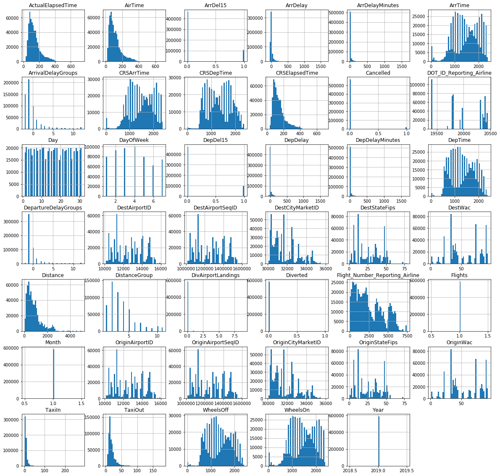
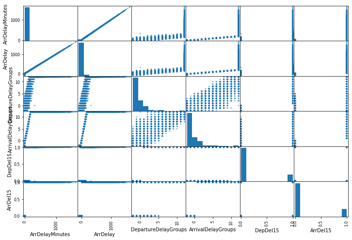
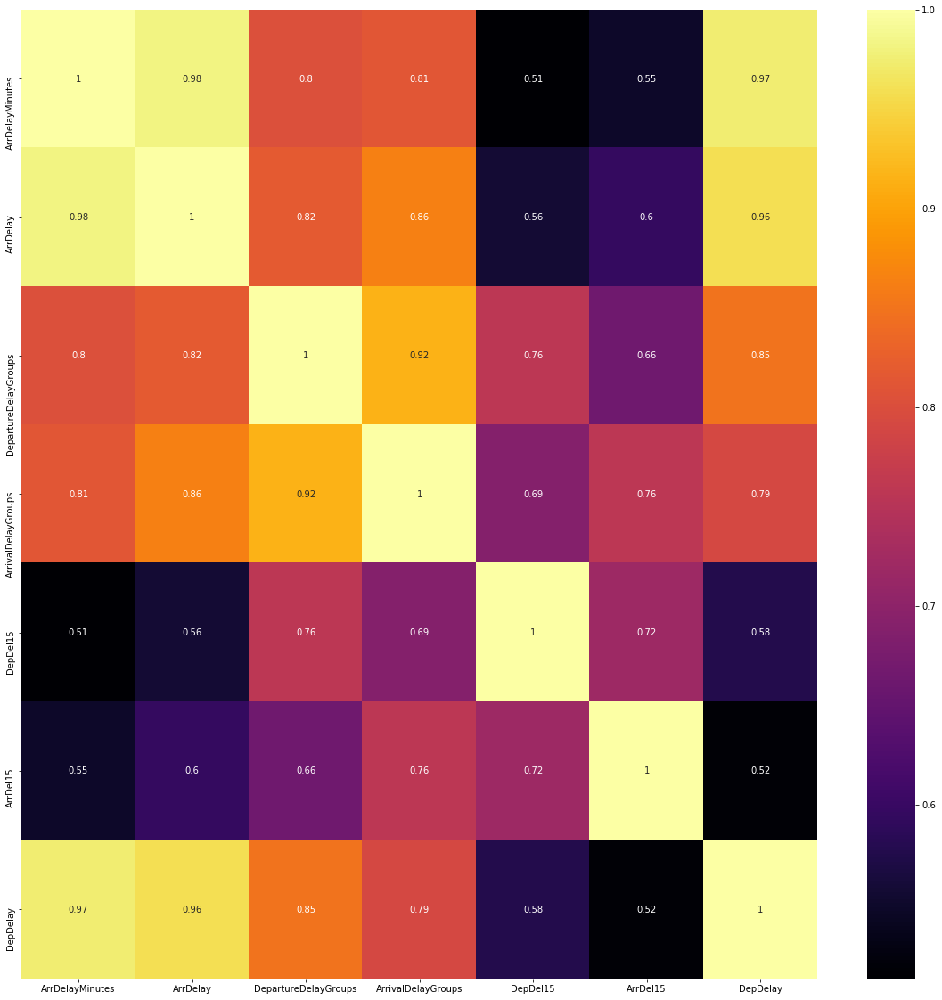

# Dataset : 2019 flight dataset.csv
# Description: This is a regression machine learning problem
# Label : To Predict the departure delay(Departure_Delay) 


### Imports


```python
import pandas as pd
import numpy as np
import matplotlib.pyplot as plt
import seaborn as sns

from pandas.plotting import scatter_matrix

from sklearn.metrics import mean_squared_error
from sklearn.model_selection import cross_val_score
from sklearn.metrics import mean_absolute_error
from sklearn.impute import SimpleImputer

from sklearn.linear_model import LinearRegression
from sklearn.tree import DecisionTreeRegressor
from sklearn.ensemble import RandomForestRegressor
from sklearn.svm import SVR
```

### Custom functions


```python
### Missing valus Table
def missing_zero_values_table(df):
        zero_val = (df == 0.00).astype(int).sum(axis=0)
        mis_val = df.isnull().sum()
        mis_val_percent = 100 * df.isnull().sum() / len(df)
        mz_table = pd.concat([zero_val, mis_val, mis_val_percent], axis=1)
        mz_table = mz_table.rename(
        columns = {0 : 'Zero Values', 1 : 'Missing Values', 2 : '% of Total Values'})
        mz_table['Total Zero Missing Values'] = mz_table['Zero Values'] + mz_table['Missing Values']
        mz_table['% Total Zero Missing Values'] = 100 * mz_table['Total Zero Missing Values'] / len(df)
        mz_table['Data Type'] = df.dtypes
        mz_table = mz_table[
            mz_table.iloc[:,1] != 0].sort_values(
        '% of Total Values', ascending=False).round(1)
        print ("Your selected dataframe has " + str(df.shape[1]) + " columns and " + str(df.shape[0]) + " Rows.\n"      
            "There are " + str(mz_table.shape[0]) +
              " columns that have missing values.")
#         mz_table.to_excel('D:/sampledata/missing_and_zero_values.xlsx', freeze_panes=(1,0), index = False)
        return mz_table
```


```python
# Show Mean, Standatd Deviation
def display_scores(scores):
#     print("Scores:", scores)
    print("Mean :", scores.mean())
    print("Standard deviation:", scores.std())
```

### Read datset


```python
flights = pd.read_csv("2019 flight dataset.csv",low_memory=False)
```


```python
flights.head()
```


<div>
<style scoped>
    .dataframe tbody tr th:only-of-type {
        vertical-align: middle;
    }

    .dataframe tbody tr th {
        vertical-align: top;
    }

    .dataframe thead th {
        text-align: right;
    }
</style>
<table border="1" class="dataframe">
  <thead>
    <tr style="text-align: right;">
      <th></th>
      <th>Year</th>
      <th>Month</th>
      <th>Day</th>
      <th>DayOfWeek</th>
      <th>FlightDate</th>
      <th>Reporting_Airline</th>
      <th>DOT_ID_Reporting_Airline</th>
      <th>IATA_CODE_Reporting_Airline</th>
      <th>Tail_Number</th>
      <th>Flight_Number_Reporting_Airline</th>
      <th>...</th>
      <th>DistanceGroup</th>
      <th>CarrierDelay</th>
      <th>WeatherDelay</th>
      <th>NASDelay</th>
      <th>SecurityDelay</th>
      <th>LateAircraftDelay</th>
      <th>FirstDepTime</th>
      <th>TotalAddGTime</th>
      <th>LongestAddGTime</th>
      <th>DivAirportLandings</th>
    </tr>
  </thead>
  <tbody>
    <tr>
      <th>0</th>
      <td>2019</td>
      <td>1</td>
      <td>4</td>
      <td>5</td>
      <td>1/4/2019</td>
      <td>OO</td>
      <td>20304</td>
      <td>OO</td>
      <td>N945SW</td>
      <td>5657</td>
      <td>...</td>
      <td>1</td>
      <td>NaN</td>
      <td>NaN</td>
      <td>NaN</td>
      <td>NaN</td>
      <td>NaN</td>
      <td>NaN</td>
      <td>NaN</td>
      <td>NaN</td>
      <td>0</td>
    </tr>
    <tr>
      <th>1</th>
      <td>2019</td>
      <td>1</td>
      <td>4</td>
      <td>5</td>
      <td>1/4/2019</td>
      <td>OO</td>
      <td>20304</td>
      <td>OO</td>
      <td>N932SW</td>
      <td>5658</td>
      <td>...</td>
      <td>2</td>
      <td>NaN</td>
      <td>NaN</td>
      <td>NaN</td>
      <td>NaN</td>
      <td>NaN</td>
      <td>NaN</td>
      <td>NaN</td>
      <td>NaN</td>
      <td>0</td>
    </tr>
    <tr>
      <th>2</th>
      <td>2019</td>
      <td>1</td>
      <td>4</td>
      <td>5</td>
      <td>1/4/2019</td>
      <td>OO</td>
      <td>20304</td>
      <td>OO</td>
      <td>N932SW</td>
      <td>5658</td>
      <td>...</td>
      <td>3</td>
      <td>NaN</td>
      <td>NaN</td>
      <td>NaN</td>
      <td>NaN</td>
      <td>NaN</td>
      <td>NaN</td>
      <td>NaN</td>
      <td>NaN</td>
      <td>0</td>
    </tr>
    <tr>
      <th>3</th>
      <td>2019</td>
      <td>1</td>
      <td>4</td>
      <td>5</td>
      <td>1/4/2019</td>
      <td>OO</td>
      <td>20304</td>
      <td>OO</td>
      <td>N916SW</td>
      <td>5659</td>
      <td>...</td>
      <td>3</td>
      <td>NaN</td>
      <td>NaN</td>
      <td>NaN</td>
      <td>NaN</td>
      <td>NaN</td>
      <td>NaN</td>
      <td>NaN</td>
      <td>NaN</td>
      <td>0</td>
    </tr>
    <tr>
      <th>4</th>
      <td>2019</td>
      <td>1</td>
      <td>4</td>
      <td>5</td>
      <td>1/4/2019</td>
      <td>OO</td>
      <td>20304</td>
      <td>OO</td>
      <td>N107SY</td>
      <td>5660</td>
      <td>...</td>
      <td>4</td>
      <td>NaN</td>
      <td>NaN</td>
      <td>NaN</td>
      <td>NaN</td>
      <td>NaN</td>
      <td>NaN</td>
      <td>NaN</td>
      <td>NaN</td>
      <td>0</td>
    </tr>
  </tbody>
</table>
<p>5 rows × 64 columns</p>
</div>


```python
flights.filter(['DepDelay', 'DepDelayMinutes'])
```


<div>
<style scoped>
    .dataframe tbody tr th:only-of-type {
        vertical-align: middle;
    }

    .dataframe tbody tr th {
        vertical-align: top;
    }

    .dataframe thead th {
        text-align: right;
    }
</style>
<table border="1" class="dataframe">
  <thead>
    <tr style="text-align: right;">
      <th></th>
      <th>DepDelay</th>
      <th>DepDelayMinutes</th>
    </tr>
  </thead>
  <tbody>
    <tr>
      <th>0</th>
      <td>-7.0</td>
      <td>0.0</td>
    </tr>
    <tr>
      <th>1</th>
      <td>-5.0</td>
      <td>0.0</td>
    </tr>
    <tr>
      <th>2</th>
      <td>-6.0</td>
      <td>0.0</td>
    </tr>
    <tr>
      <th>3</th>
      <td>-21.0</td>
      <td>0.0</td>
    </tr>
    <tr>
      <th>4</th>
      <td>-10.0</td>
      <td>0.0</td>
    </tr>
    <tr>
      <th>5</th>
      <td>-10.0</td>
      <td>0.0</td>
    </tr>
    <tr>
      <th>6</th>
      <td>-1.0</td>
      <td>0.0</td>
    </tr>
    <tr>
      <th>7</th>
      <td>8.0</td>
      <td>8.0</td>
    </tr>
    <tr>
      <th>8</th>
      <td>-13.0</td>
      <td>0.0</td>
    </tr>
    <tr>
      <th>9</th>
      <td>-4.0</td>
      <td>0.0</td>
    </tr>
    <tr>
      <th>10</th>
      <td>5.0</td>
      <td>5.0</td>
    </tr>
    <tr>
      <th>11</th>
      <td>23.0</td>
      <td>23.0</td>
    </tr>
    <tr>
      <th>12</th>
      <td>-5.0</td>
      <td>0.0</td>
    </tr>
    <tr>
      <th>13</th>
      <td>-12.0</td>
      <td>0.0</td>
    </tr>
    <tr>
      <th>14</th>
      <td>-11.0</td>
      <td>0.0</td>
    </tr>
    <tr>
      <th>15</th>
      <td>-10.0</td>
      <td>0.0</td>
    </tr>
    <tr>
      <th>16</th>
      <td>-6.0</td>
      <td>0.0</td>
    </tr>
    <tr>
      <th>17</th>
      <td>-5.0</td>
      <td>0.0</td>
    </tr>
    <tr>
      <th>18</th>
      <td>-9.0</td>
      <td>0.0</td>
    </tr>
    <tr>
      <th>19</th>
      <td>-9.0</td>
      <td>0.0</td>
    </tr>
    <tr>
      <th>20</th>
      <td>4.0</td>
      <td>4.0</td>
    </tr>
    <tr>
      <th>21</th>
      <td>-6.0</td>
      <td>0.0</td>
    </tr>
    <tr>
      <th>22</th>
      <td>3.0</td>
      <td>3.0</td>
    </tr>
    <tr>
      <th>23</th>
      <td>-9.0</td>
      <td>0.0</td>
    </tr>
    <tr>
      <th>24</th>
      <td>NaN</td>
      <td>NaN</td>
    </tr>
    <tr>
      <th>25</th>
      <td>3.0</td>
      <td>3.0</td>
    </tr>
    <tr>
      <th>26</th>
      <td>0.0</td>
      <td>0.0</td>
    </tr>
    <tr>
      <th>27</th>
      <td>-5.0</td>
      <td>0.0</td>
    </tr>
    <tr>
      <th>28</th>
      <td>-5.0</td>
      <td>0.0</td>
    </tr>
    <tr>
      <th>29</th>
      <td>2.0</td>
      <td>2.0</td>
    </tr>
    <tr>
      <th>...</th>
      <td>...</td>
      <td>...</td>
    </tr>
    <tr>
      <th>583955</th>
      <td>2.0</td>
      <td>2.0</td>
    </tr>
    <tr>
      <th>583956</th>
      <td>25.0</td>
      <td>25.0</td>
    </tr>
    <tr>
      <th>583957</th>
      <td>-7.0</td>
      <td>0.0</td>
    </tr>
    <tr>
      <th>583958</th>
      <td>-7.0</td>
      <td>0.0</td>
    </tr>
    <tr>
      <th>583959</th>
      <td>-6.0</td>
      <td>0.0</td>
    </tr>
    <tr>
      <th>583960</th>
      <td>1.0</td>
      <td>1.0</td>
    </tr>
    <tr>
      <th>583961</th>
      <td>-1.0</td>
      <td>0.0</td>
    </tr>
    <tr>
      <th>583962</th>
      <td>51.0</td>
      <td>51.0</td>
    </tr>
    <tr>
      <th>583963</th>
      <td>31.0</td>
      <td>31.0</td>
    </tr>
    <tr>
      <th>583964</th>
      <td>6.0</td>
      <td>6.0</td>
    </tr>
    <tr>
      <th>583965</th>
      <td>44.0</td>
      <td>44.0</td>
    </tr>
    <tr>
      <th>583966</th>
      <td>5.0</td>
      <td>5.0</td>
    </tr>
    <tr>
      <th>583967</th>
      <td>-7.0</td>
      <td>0.0</td>
    </tr>
    <tr>
      <th>583968</th>
      <td>51.0</td>
      <td>51.0</td>
    </tr>
    <tr>
      <th>583969</th>
      <td>0.0</td>
      <td>0.0</td>
    </tr>
    <tr>
      <th>583970</th>
      <td>-7.0</td>
      <td>0.0</td>
    </tr>
    <tr>
      <th>583971</th>
      <td>4.0</td>
      <td>4.0</td>
    </tr>
    <tr>
      <th>583972</th>
      <td>4.0</td>
      <td>4.0</td>
    </tr>
    <tr>
      <th>583973</th>
      <td>47.0</td>
      <td>47.0</td>
    </tr>
    <tr>
      <th>583974</th>
      <td>-10.0</td>
      <td>0.0</td>
    </tr>
    <tr>
      <th>583975</th>
      <td>3.0</td>
      <td>3.0</td>
    </tr>
    <tr>
      <th>583976</th>
      <td>53.0</td>
      <td>53.0</td>
    </tr>
    <tr>
      <th>583977</th>
      <td>-11.0</td>
      <td>0.0</td>
    </tr>
    <tr>
      <th>583978</th>
      <td>-2.0</td>
      <td>0.0</td>
    </tr>
    <tr>
      <th>583979</th>
      <td>-7.0</td>
      <td>0.0</td>
    </tr>
    <tr>
      <th>583980</th>
      <td>-8.0</td>
      <td>0.0</td>
    </tr>
    <tr>
      <th>583981</th>
      <td>4.0</td>
      <td>4.0</td>
    </tr>
    <tr>
      <th>583982</th>
      <td>-3.0</td>
      <td>0.0</td>
    </tr>
    <tr>
      <th>583983</th>
      <td>-4.0</td>
      <td>0.0</td>
    </tr>
    <tr>
      <th>583984</th>
      <td>-5.0</td>
      <td>0.0</td>
    </tr>
  </tbody>
</table>
<p>583985 rows × 2 columns</p>
</div>


```python
flights["Reporting_Airline"].value_counts( sort=False)
```


    OO     64926
    DL     73836
    WN    111312
    UA     46915
    NK     15222
    F9      9647
    EV     13195
    HA      6798
    YX     25755
    9E     20198
    AA     77017
    YV     18346
    MQ     25699
    G4      6763
    AS     20744
    OH     23169
    B6     24443
    Name: Reporting_Airline, dtype: int64


## Data Preprocessing / Data Cleaning

#### Dataset has,
* 64 classes
* 583985 records

## Columns are

<ol>
<li>Year</li>
<li>Month</li>
<li>Day</li>
<li>DayOfWeek</li>
<li>FlightDate</li>
<li>Reporting_Airline</li>
<li>DOT_ID_Reporting_Airline</li>
<li>IATA_CODE_Reporting_Airline</li>
<li>Tail_Number</li>
<li>Flight_Number_Reporting_Airline</li>
<li>OriginAirportID</li>
<li>OriginAirportSeqID</li>
<li>OriginCityMarketID</li>
<li>Origin</li>
<li>OriginCityName</li>
<li>OriginState</li>
<li>OriginStateFips</li>
<li>OriginStateName</li>
<li>OriginWac</li>
<li>DestAirportID</li>
<li>DestAirportSeqID</li>
<li>DestCityMarketID</li>
<li>Dest</li>
<li>DestCityName</li>
<li>DestState</li>
<li>DestStateFips</li>
<li>DestStateName</li>
<li>DestWac</li>
<li>CRSDepTime</li>
<li>DepTime</li>
<li>DepDelay</li>
<li>DepDelayMinutes</li>
<li>DepDel15</li>
<li>DepartureDelayGroups</li>
<li>DepTimeBlk</li>
<li>TaxiOut</li>
<li>WheelsOff</li>
<li>WheelsOn</li>
<li>TaxiIn</li>
<li>CRSArrTime</li>
<li>ArrTime</li>
<li>ArrDelay</li>
<li>ArrDelayMinutes</li>
<li>ArrDel15</li>
<li>ArrivalDelayGroups</li>
<li>ArrTimeBlk</li>
<li>Cancelled</li>
<li>CancellationCode</li>
<li>Diverted</li>
<li>CRSElapsedTime</li>
<li>ActualElapsedTime</li>
<li>AirTime</li>
<li>Flights</li>
<li>Distance</li>
<li>DistanceGroup</li>
<li>CarrierDelay</li>
<li>WeatherDelay</li>
<li>NASDelay</li>
<li>SecurityDelay</li>
<li>LateAircraftDelay</li>
<li>FirstDepTime</li>
<li>TotalAddGTime</li>
<li>LongestAddGTime</li>
<li>DivAirportLandings</li>
</ol>

### Dataset has
* 49 numerical columns
* 15 categorical columns


```python
flights.describe()
```


<div>
<style scoped>
    .dataframe tbody tr th:only-of-type {
        vertical-align: middle;
    }

    .dataframe tbody tr th {
        vertical-align: top;
    }

    .dataframe thead th {
        text-align: right;
    }
</style>
<table border="1" class="dataframe">
  <thead>
    <tr style="text-align: right;">
      <th></th>
      <th>Year</th>
      <th>Month</th>
      <th>Day</th>
      <th>DayOfWeek</th>
      <th>DOT_ID_Reporting_Airline</th>
      <th>Flight_Number_Reporting_Airline</th>
      <th>OriginAirportID</th>
      <th>OriginAirportSeqID</th>
      <th>OriginCityMarketID</th>
      <th>OriginStateFips</th>
      <th>...</th>
      <th>DistanceGroup</th>
      <th>CarrierDelay</th>
      <th>WeatherDelay</th>
      <th>NASDelay</th>
      <th>SecurityDelay</th>
      <th>LateAircraftDelay</th>
      <th>FirstDepTime</th>
      <th>TotalAddGTime</th>
      <th>LongestAddGTime</th>
      <th>DivAirportLandings</th>
    </tr>
  </thead>
  <tbody>
    <tr>
      <th>count</th>
      <td>583985.0</td>
      <td>583985.0</td>
      <td>583985.000000</td>
      <td>583985.000000</td>
      <td>583985.000000</td>
      <td>583985.000000</td>
      <td>583985.000000</td>
      <td>5.839850e+05</td>
      <td>583985.000000</td>
      <td>583985.000000</td>
      <td>...</td>
      <td>583985.000000</td>
      <td>105222.000000</td>
      <td>105222.000000</td>
      <td>105222.000000</td>
      <td>105222.000000</td>
      <td>105222.000000</td>
      <td>3962.000000</td>
      <td>3962.000000</td>
      <td>3962.000000</td>
      <td>583985.000000</td>
    </tr>
    <tr>
      <th>mean</th>
      <td>2019.0</td>
      <td>1.0</td>
      <td>15.960088</td>
      <td>3.835626</td>
      <td>19983.213168</td>
      <td>2537.869334</td>
      <td>12659.701982</td>
      <td>1.265974e+06</td>
      <td>31753.325344</td>
      <td>26.850369</td>
      <td>...</td>
      <td>3.664861</td>
      <td>20.106080</td>
      <td>4.428551</td>
      <td>18.508392</td>
      <td>0.079508</td>
      <td>24.950590</td>
      <td>1278.071933</td>
      <td>37.506815</td>
      <td>36.776628</td>
      <td>0.003935</td>
    </tr>
    <tr>
      <th>std</th>
      <td>0.0</td>
      <td>0.0</td>
      <td>8.987942</td>
      <td>1.921899</td>
      <td>377.724638</td>
      <td>1821.736145</td>
      <td>1519.405493</td>
      <td>1.519403e+05</td>
      <td>1298.582915</td>
      <td>16.506263</td>
      <td>...</td>
      <td>2.323890</td>
      <td>65.762202</td>
      <td>38.535323</td>
      <td>41.726392</td>
      <td>3.203342</td>
      <td>50.851973</td>
      <td>510.584001</td>
      <td>31.837723</td>
      <td>30.090092</td>
      <td>0.132386</td>
    </tr>
    <tr>
      <th>min</th>
      <td>2019.0</td>
      <td>1.0</td>
      <td>1.000000</td>
      <td>1.000000</td>
      <td>19393.000000</td>
      <td>1.000000</td>
      <td>10135.000000</td>
      <td>1.013505e+06</td>
      <td>30070.000000</td>
      <td>1.000000</td>
      <td>...</td>
      <td>1.000000</td>
      <td>0.000000</td>
      <td>0.000000</td>
      <td>0.000000</td>
      <td>0.000000</td>
      <td>0.000000</td>
      <td>4.000000</td>
      <td>1.000000</td>
      <td>1.000000</td>
      <td>0.000000</td>
    </tr>
    <tr>
      <th>25%</th>
      <td>2019.0</td>
      <td>1.0</td>
      <td>8.000000</td>
      <td>2.000000</td>
      <td>19790.000000</td>
      <td>979.000000</td>
      <td>11292.000000</td>
      <td>1.129202e+06</td>
      <td>30721.000000</td>
      <td>12.000000</td>
      <td>...</td>
      <td>2.000000</td>
      <td>0.000000</td>
      <td>0.000000</td>
      <td>0.000000</td>
      <td>0.000000</td>
      <td>0.000000</td>
      <td>824.000000</td>
      <td>16.000000</td>
      <td>16.000000</td>
      <td>0.000000</td>
    </tr>
    <tr>
      <th>50%</th>
      <td>2019.0</td>
      <td>1.0</td>
      <td>16.000000</td>
      <td>4.000000</td>
      <td>19977.000000</td>
      <td>2114.000000</td>
      <td>12889.000000</td>
      <td>1.288903e+06</td>
      <td>31453.000000</td>
      <td>26.000000</td>
      <td>...</td>
      <td>3.000000</td>
      <td>0.000000</td>
      <td>0.000000</td>
      <td>5.000000</td>
      <td>0.000000</td>
      <td>0.000000</td>
      <td>1228.000000</td>
      <td>29.000000</td>
      <td>28.000000</td>
      <td>0.000000</td>
    </tr>
    <tr>
      <th>75%</th>
      <td>2019.0</td>
      <td>1.0</td>
      <td>24.000000</td>
      <td>5.000000</td>
      <td>20368.000000</td>
      <td>3902.000000</td>
      <td>13931.000000</td>
      <td>1.393102e+06</td>
      <td>32467.000000</td>
      <td>42.000000</td>
      <td>...</td>
      <td>5.000000</td>
      <td>16.000000</td>
      <td>0.000000</td>
      <td>21.000000</td>
      <td>0.000000</td>
      <td>29.000000</td>
      <td>1719.000000</td>
      <td>46.000000</td>
      <td>46.000000</td>
      <td>0.000000</td>
    </tr>
    <tr>
      <th>max</th>
      <td>2019.0</td>
      <td>1.0</td>
      <td>31.000000</td>
      <td>7.000000</td>
      <td>20452.000000</td>
      <td>7439.000000</td>
      <td>16218.000000</td>
      <td>1.621801e+06</td>
      <td>35991.000000</td>
      <td>78.000000</td>
      <td>...</td>
      <td>11.000000</td>
      <td>1638.000000</td>
      <td>1416.000000</td>
      <td>1447.000000</td>
      <td>816.000000</td>
      <td>1514.000000</td>
      <td>2358.000000</td>
      <td>297.000000</td>
      <td>246.000000</td>
      <td>9.000000</td>
    </tr>
  </tbody>
</table>
<p>8 rows × 49 columns</p>
</div>


### Missing values


```python
missing_zero_values_table(flights)
```

    Your selected dataframe has 64 columns and 583985 Rows.
    There are 27 columns that have missing values.
    


<div>
<style scoped>
    .dataframe tbody tr th:only-of-type {
        vertical-align: middle;
    }

    .dataframe tbody tr th {
        vertical-align: top;
    }

    .dataframe thead th {
        text-align: right;
    }
</style>
<table border="1" class="dataframe">
  <thead>
    <tr style="text-align: right;">
      <th></th>
      <th>Zero Values</th>
      <th>Missing Values</th>
      <th>% of Total Values</th>
      <th>Total Zero Missing Values</th>
      <th>% Total Zero Missing Values</th>
      <th>Data Type</th>
    </tr>
  </thead>
  <tbody>
    <tr>
      <th>LongestAddGTime</th>
      <td>0</td>
      <td>580023</td>
      <td>99.3</td>
      <td>580023</td>
      <td>99.3</td>
      <td>float64</td>
    </tr>
    <tr>
      <th>TotalAddGTime</th>
      <td>0</td>
      <td>580023</td>
      <td>99.3</td>
      <td>580023</td>
      <td>99.3</td>
      <td>float64</td>
    </tr>
    <tr>
      <th>FirstDepTime</th>
      <td>0</td>
      <td>580023</td>
      <td>99.3</td>
      <td>580023</td>
      <td>99.3</td>
      <td>float64</td>
    </tr>
    <tr>
      <th>CancellationCode</th>
      <td>0</td>
      <td>567259</td>
      <td>97.1</td>
      <td>567259</td>
      <td>97.1</td>
      <td>object</td>
    </tr>
    <tr>
      <th>LateAircraftDelay</th>
      <td>53797</td>
      <td>478763</td>
      <td>82.0</td>
      <td>532560</td>
      <td>91.2</td>
      <td>float64</td>
    </tr>
    <tr>
      <th>SecurityDelay</th>
      <td>104890</td>
      <td>478763</td>
      <td>82.0</td>
      <td>583653</td>
      <td>99.9</td>
      <td>float64</td>
    </tr>
    <tr>
      <th>NASDelay</th>
      <td>43421</td>
      <td>478763</td>
      <td>82.0</td>
      <td>522184</td>
      <td>89.4</td>
      <td>float64</td>
    </tr>
    <tr>
      <th>WeatherDelay</th>
      <td>97501</td>
      <td>478763</td>
      <td>82.0</td>
      <td>576264</td>
      <td>98.7</td>
      <td>float64</td>
    </tr>
    <tr>
      <th>CarrierDelay</th>
      <td>58078</td>
      <td>478763</td>
      <td>82.0</td>
      <td>536841</td>
      <td>91.9</td>
      <td>float64</td>
    </tr>
    <tr>
      <th>ArrivalDelayGroups</th>
      <td>98402</td>
      <td>18022</td>
      <td>3.1</td>
      <td>116424</td>
      <td>19.9</td>
      <td>float64</td>
    </tr>
    <tr>
      <th>AirTime</th>
      <td>0</td>
      <td>18022</td>
      <td>3.1</td>
      <td>18022</td>
      <td>3.1</td>
      <td>float64</td>
    </tr>
    <tr>
      <th>ActualElapsedTime</th>
      <td>0</td>
      <td>18022</td>
      <td>3.1</td>
      <td>18022</td>
      <td>3.1</td>
      <td>float64</td>
    </tr>
    <tr>
      <th>ArrDel15</th>
      <td>460741</td>
      <td>18022</td>
      <td>3.1</td>
      <td>478763</td>
      <td>82.0</td>
      <td>float64</td>
    </tr>
    <tr>
      <th>ArrDelayMinutes</th>
      <td>372769</td>
      <td>18022</td>
      <td>3.1</td>
      <td>390791</td>
      <td>66.9</td>
      <td>float64</td>
    </tr>
    <tr>
      <th>ArrDelay</th>
      <td>10430</td>
      <td>18022</td>
      <td>3.1</td>
      <td>28452</td>
      <td>4.9</td>
      <td>float64</td>
    </tr>
    <tr>
      <th>ArrTime</th>
      <td>0</td>
      <td>17061</td>
      <td>2.9</td>
      <td>17061</td>
      <td>2.9</td>
      <td>float64</td>
    </tr>
    <tr>
      <th>TaxiIn</th>
      <td>0</td>
      <td>17061</td>
      <td>2.9</td>
      <td>17061</td>
      <td>2.9</td>
      <td>float64</td>
    </tr>
    <tr>
      <th>WheelsOn</th>
      <td>0</td>
      <td>17061</td>
      <td>2.9</td>
      <td>17061</td>
      <td>2.9</td>
      <td>float64</td>
    </tr>
    <tr>
      <th>WheelsOff</th>
      <td>0</td>
      <td>16616</td>
      <td>2.8</td>
      <td>16616</td>
      <td>2.8</td>
      <td>float64</td>
    </tr>
    <tr>
      <th>TaxiOut</th>
      <td>0</td>
      <td>16616</td>
      <td>2.8</td>
      <td>16616</td>
      <td>2.8</td>
      <td>float64</td>
    </tr>
    <tr>
      <th>DepartureDelayGroups</th>
      <td>113774</td>
      <td>16355</td>
      <td>2.8</td>
      <td>130129</td>
      <td>22.3</td>
      <td>float64</td>
    </tr>
    <tr>
      <th>DepDel15</th>
      <td>468703</td>
      <td>16355</td>
      <td>2.8</td>
      <td>485058</td>
      <td>83.1</td>
      <td>float64</td>
    </tr>
    <tr>
      <th>DepDelayMinutes</th>
      <td>382148</td>
      <td>16355</td>
      <td>2.8</td>
      <td>398503</td>
      <td>68.2</td>
      <td>float64</td>
    </tr>
    <tr>
      <th>DepDelay</th>
      <td>27219</td>
      <td>16355</td>
      <td>2.8</td>
      <td>43574</td>
      <td>7.5</td>
      <td>float64</td>
    </tr>
    <tr>
      <th>DepTime</th>
      <td>0</td>
      <td>16353</td>
      <td>2.8</td>
      <td>16353</td>
      <td>2.8</td>
      <td>float64</td>
    </tr>
    <tr>
      <th>Tail_Number</th>
      <td>0</td>
      <td>2543</td>
      <td>0.4</td>
      <td>2543</td>
      <td>0.4</td>
      <td>object</td>
    </tr>
    <tr>
      <th>CRSElapsedTime</th>
      <td>0</td>
      <td>134</td>
      <td>0.0</td>
      <td>134</td>
      <td>0.0</td>
      <td>float64</td>
    </tr>
  </tbody>
</table>
</div>


### Missing values

##### We can clearly see below columns has more than 80% of missing values so we cannot use or impute them to create the model

* LongestAddGTime
* TotalAddGTime
* FirstDepTime
* CancellationCode
* LateAircraftDelay
* SecurityDelay
* NASDelay
* WeatherDelay
* CarrierDelay

**** We have to remove(clean) those columns


```python
missing_cols = flights.columns[flights.isnull().any()].tolist()
```


```python
unwanted_cols = ['LongestAddGTime', 'TotalAddGTime', 'FirstDepTime', 'CancellationCode', 'LateAircraftDelay', 'SecurityDelay', 'NASDelay', 'WeatherDelay', 'CarrierDelay']
```


```python
flights_clean = flights.drop(unwanted_cols, axis=1)
```

#### There are two non numerical types are in the table 
* CancellationCode	
* Tail_Number

CancellationCode is already removed because of 97.1 % missing values 

#### A tail number refers to an identification number painted on an aircraft, frequently on the tail. 
##### Reference: https://en.wikipedia.org/wiki/Tail_number

Tail number gives only the number of the vehicle and it not gives any details about delay


```python
flights_clean = flights_clean.drop(['Tail_Number'], axis=1)
```


```python
missing_zero_values_table(flights_clean)
```

    Your selected dataframe has 54 columns and 583985 Rows.
    There are 17 columns that have missing values.
    


<div>
<style scoped>
    .dataframe tbody tr th:only-of-type {
        vertical-align: middle;
    }

    .dataframe tbody tr th {
        vertical-align: top;
    }

    .dataframe thead th {
        text-align: right;
    }
</style>
<table border="1" class="dataframe">
  <thead>
    <tr style="text-align: right;">
      <th></th>
      <th>Zero Values</th>
      <th>Missing Values</th>
      <th>% of Total Values</th>
      <th>Total Zero Missing Values</th>
      <th>% Total Zero Missing Values</th>
      <th>Data Type</th>
    </tr>
  </thead>
  <tbody>
    <tr>
      <th>AirTime</th>
      <td>0</td>
      <td>18022</td>
      <td>3.1</td>
      <td>18022</td>
      <td>3.1</td>
      <td>float64</td>
    </tr>
    <tr>
      <th>ActualElapsedTime</th>
      <td>0</td>
      <td>18022</td>
      <td>3.1</td>
      <td>18022</td>
      <td>3.1</td>
      <td>float64</td>
    </tr>
    <tr>
      <th>ArrivalDelayGroups</th>
      <td>98402</td>
      <td>18022</td>
      <td>3.1</td>
      <td>116424</td>
      <td>19.9</td>
      <td>float64</td>
    </tr>
    <tr>
      <th>ArrDel15</th>
      <td>460741</td>
      <td>18022</td>
      <td>3.1</td>
      <td>478763</td>
      <td>82.0</td>
      <td>float64</td>
    </tr>
    <tr>
      <th>ArrDelayMinutes</th>
      <td>372769</td>
      <td>18022</td>
      <td>3.1</td>
      <td>390791</td>
      <td>66.9</td>
      <td>float64</td>
    </tr>
    <tr>
      <th>ArrDelay</th>
      <td>10430</td>
      <td>18022</td>
      <td>3.1</td>
      <td>28452</td>
      <td>4.9</td>
      <td>float64</td>
    </tr>
    <tr>
      <th>ArrTime</th>
      <td>0</td>
      <td>17061</td>
      <td>2.9</td>
      <td>17061</td>
      <td>2.9</td>
      <td>float64</td>
    </tr>
    <tr>
      <th>TaxiIn</th>
      <td>0</td>
      <td>17061</td>
      <td>2.9</td>
      <td>17061</td>
      <td>2.9</td>
      <td>float64</td>
    </tr>
    <tr>
      <th>WheelsOn</th>
      <td>0</td>
      <td>17061</td>
      <td>2.9</td>
      <td>17061</td>
      <td>2.9</td>
      <td>float64</td>
    </tr>
    <tr>
      <th>WheelsOff</th>
      <td>0</td>
      <td>16616</td>
      <td>2.8</td>
      <td>16616</td>
      <td>2.8</td>
      <td>float64</td>
    </tr>
    <tr>
      <th>TaxiOut</th>
      <td>0</td>
      <td>16616</td>
      <td>2.8</td>
      <td>16616</td>
      <td>2.8</td>
      <td>float64</td>
    </tr>
    <tr>
      <th>DepDelay</th>
      <td>27219</td>
      <td>16355</td>
      <td>2.8</td>
      <td>43574</td>
      <td>7.5</td>
      <td>float64</td>
    </tr>
    <tr>
      <th>DepartureDelayGroups</th>
      <td>113774</td>
      <td>16355</td>
      <td>2.8</td>
      <td>130129</td>
      <td>22.3</td>
      <td>float64</td>
    </tr>
    <tr>
      <th>DepDel15</th>
      <td>468703</td>
      <td>16355</td>
      <td>2.8</td>
      <td>485058</td>
      <td>83.1</td>
      <td>float64</td>
    </tr>
    <tr>
      <th>DepDelayMinutes</th>
      <td>382148</td>
      <td>16355</td>
      <td>2.8</td>
      <td>398503</td>
      <td>68.2</td>
      <td>float64</td>
    </tr>
    <tr>
      <th>DepTime</th>
      <td>0</td>
      <td>16353</td>
      <td>2.8</td>
      <td>16353</td>
      <td>2.8</td>
      <td>float64</td>
    </tr>
    <tr>
      <th>CRSElapsedTime</th>
      <td>0</td>
      <td>134</td>
      <td>0.0</td>
      <td>134</td>
      <td>0.0</td>
      <td>float64</td>
    </tr>
  </tbody>
</table>
</div>


```python
flights_clean.hist(bins=50, figsize=(20,20))
plt.show()
```





## Date Features
<ol>
<li>Year</li>
<li>Month</li>
<li>Day</li>
<li>DayOfWeek</li>
<li>FlightDate</li>
</ol>

Year, Month, Day and FlightDate gives the same information and most

# Correlation Analysis


```python
corr_matrix = flights_clean.corr()
```


```python
corr_matrix["DepDelay"].sort_values(ascending=False)
```


    DepDelay                           1.000000
    DepDelayMinutes                    0.997019
    ArrDelayMinutes                    0.973982
    ArrDelay                           0.959519
    DepartureDelayGroups               0.848956
    ArrivalDelayGroups                 0.791768
    DepDel15                           0.576696
    ArrDel15                           0.516949
    DepTime                            0.117520
    WheelsOff                          0.109737
    TaxiOut                            0.092145
    CRSDepTime                         0.075406
    CRSArrTime                         0.070041
    DOT_ID_Reporting_Airline           0.049513
    Day                                0.039659
    Cancelled                          0.030734
    Flight_Number_Reporting_Airline    0.028703
    WheelsOn                           0.025837
    ActualElapsedTime                  0.024121
    Diverted                           0.020569
    TaxiIn                             0.020234
    ArrTime                            0.018329
    CRSElapsedTime                     0.015431
    DivAirportLandings                 0.013791
    DestAirportSeqID                   0.009946
    DestAirportID                      0.009946
    AirTime                            0.009024
    Distance                           0.007616
    DistanceGroup                      0.007478
    OriginAirportID                    0.003785
    OriginAirportSeqID                 0.003785
    DestCityMarketID                  -0.000273
    OriginStateFips                   -0.001351
    OriginCityMarketID                -0.003328
    DestStateFips                     -0.004932
    DayOfWeek                         -0.008911
    OriginWac                         -0.025629
    DestWac                           -0.028925
    Year                                    NaN
    Month                                   NaN
    Flights                                 NaN
    Name: DepDelay, dtype: float64


```python
attributes = ['ArrDelayMinutes', 'ArrDelay', 'DepartureDelayGroups','ArrivalDelayGroups', 'DepDel15',  'ArrDel15']
scatter_matrix(flights_clean[attributes], figsize=(12, 8))
plt.show()
```





## Best Correlated feaures 

* ArrDelayMinutes           
* ArrDelay                  
* DepartureDelayGroups      
* ArrivalDelayGroups        
* DepDel15                  
* ArrDel15 


```python
clean_cols = ['ArrDelayMinutes', 'ArrDelay', 'DepartureDelayGroups',
              'ArrivalDelayGroups', 'DepDel15',  'ArrDel15', 'DepDelay']

```


```python
flights_cleaned = flights_clean.filter(clean_cols, axis=1)
```

## Correlation HeatMap


```python
corrMatrix = flights_cleaned.corr()
fig, ax = plt.subplots(figsize=(20,20))    
sns.heatmap(corrMatrix, annot=True, cmap='inferno')
plt.show()
```





## Imputing missing values


```python
imputer = SimpleImputer(strategy="most_frequent")
```


```python
cols = flights_cleaned.columns
```


```python
imputer.fit(flights_cleaned)
```


    SimpleImputer(add_indicator=False, copy=True, fill_value=None,
                  missing_values=nan, strategy='most_frequent', verbose=0)


```python
flights_ = imputer.transform(flights_cleaned)
flights_tr = pd.DataFrame(flights_, columns=cols)
```


```python
flights_tr.head()
```


<div>
<style scoped>
    .dataframe tbody tr th:only-of-type {
        vertical-align: middle;
    }

    .dataframe tbody tr th {
        vertical-align: top;
    }

    .dataframe thead th {
        text-align: right;
    }
</style>
<table border="1" class="dataframe">
  <thead>
    <tr style="text-align: right;">
      <th></th>
      <th>ArrDelayMinutes</th>
      <th>ArrDelay</th>
      <th>DepartureDelayGroups</th>
      <th>ArrivalDelayGroups</th>
      <th>DepDel15</th>
      <th>ArrDel15</th>
      <th>DepDelay</th>
    </tr>
  </thead>
  <tbody>
    <tr>
      <th>0</th>
      <td>0.0</td>
      <td>-26.0</td>
      <td>-1.0</td>
      <td>-2.0</td>
      <td>0.0</td>
      <td>0.0</td>
      <td>-7.0</td>
    </tr>
    <tr>
      <th>1</th>
      <td>1.0</td>
      <td>1.0</td>
      <td>-1.0</td>
      <td>0.0</td>
      <td>0.0</td>
      <td>0.0</td>
      <td>-5.0</td>
    </tr>
    <tr>
      <th>2</th>
      <td>0.0</td>
      <td>-17.0</td>
      <td>-1.0</td>
      <td>-2.0</td>
      <td>0.0</td>
      <td>0.0</td>
      <td>-6.0</td>
    </tr>
    <tr>
      <th>3</th>
      <td>0.0</td>
      <td>-29.0</td>
      <td>-2.0</td>
      <td>-2.0</td>
      <td>0.0</td>
      <td>0.0</td>
      <td>-21.0</td>
    </tr>
    <tr>
      <th>4</th>
      <td>0.0</td>
      <td>-31.0</td>
      <td>-1.0</td>
      <td>-2.0</td>
      <td>0.0</td>
      <td>0.0</td>
      <td>-10.0</td>
    </tr>
  </tbody>
</table>
</div>


```python
X = flights_tr.drop('DepDelay', axis=1)
y = flights_tr['DepDelay']
```

## Feature Scaling


```python
from sklearn.preprocessing import StandardScaler
scaler = StandardScaler()
X_scaled = scaler.fit_transform(X=X)
```


```python
X_scaled =  pd.DataFrame(X_scaled, columns=X.columns)
```

## Train and Test Split

* 80% for train 
* 20% for test


```python
from sklearn.model_selection import train_test_split
X_train, X_test, y_train, y_test = train_test_split( X, y, test_size=0.33, random_state=42)
```


```python
X_train_scaled, X_test_scaled, y_train, y_test = train_test_split( X_scaled, y, test_size=0.33, random_state=42)
```

## Training and Validation


```python
# Show MAE, MSE, RMSE, Mean, STD

def results(reg, X_train=X_train, y_train=y_train, X_test=X_test, y_test=y_test, X=X, y=y ):
    reg.fit(X_train, y_train)
    predictions = reg.predict(X_test)
    
    mae = mean_absolute_error(y_test, predictions)
    mse = mean_squared_error(y_test, predictions)
    rmse = np.sqrt(mse)
    scores = cross_val_score(reg, X, y, scoring="neg_mean_squared_error", cv=10)
    
    print("MSE  : ", mse)
    print("RMSE :", rmse)
    print("MAE  :", mae)
    
    display_scores(scores)
```

### Linear Regression


```python
lin_reg = LinearRegression()
results(lin_reg)
```

    MSE  :  41.06336049028938
    RMSE : 6.408069950483482
    MAE  : 4.262177552892014
    Mean : -43.33374360784988
    Standard deviation: 11.44692639891666
    

### Decision Tree Regression


```python
dec_reg = DecisionTreeRegressor()
results(dec_reg)
```

    MSE  :  21.087834716703068
    RMSE : 4.592149248086681
    MAE  : 2.929428651460476
    Mean : -22.65141346371404
    Standard deviation: 7.214835185733769
    

### Random Forest Regression


```python
ran_reg = RandomForestRegressor()
results(ran_reg)
```

    MSE  :  20.788012923299657
    RMSE : 6.408069950483482
    MAE  : 2.9253668991963977
    Mean : -22.392852456106283
    Standard deviation: 7.020830739370741
    

### Support Vector Regression


```python
# svm_reg = SVR()
# results(svm_reg)
```


```python

```
